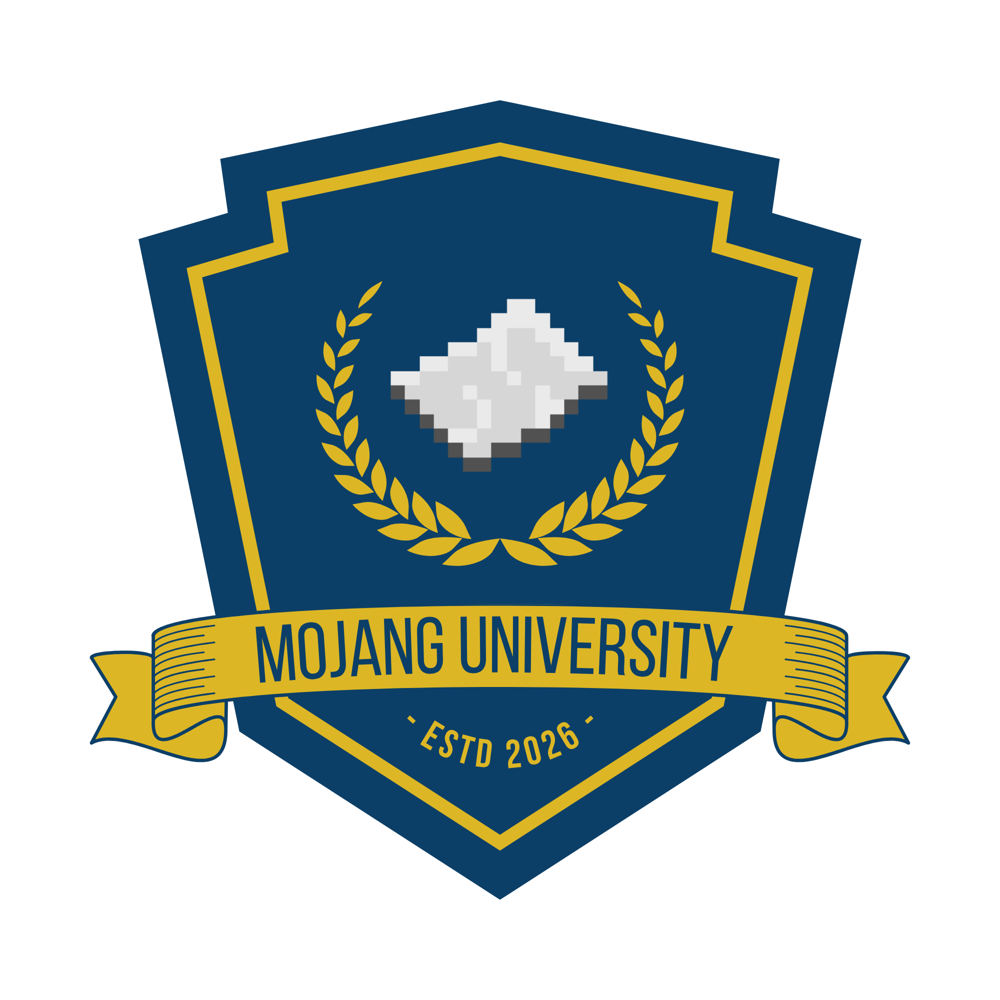

<p align="center">
  
</p>

# 🟩 Universitas Negeri Mojang (UNEMO) 🟩
> **Pusat Pendidikan Redstone & Kelangsungan Hidup Terbaik di Overworld!**


---

### ⚠️ PERINGATAN PENTING (DISCLAIMER)
**Web ini dibuat 100% untuk bersenang-senang (HAVE FUN ONLY)!** 
Aplikasi pendaftaran mahasiswa ini adalah sebuah proyek parodi/komedi. Kami tidak terafiliasi dengan Mojang Studios, Microsoft, ataupun lembaga pendidikan tinggi dunia nyata mana pun. 
Pendaftaran Anda di sini tidak akan membuat Anda diterima di universitas nyata, namun setidaknya karakter Minecraft Anda akan bangga! 😎

---

## 🏫 Tentang UNEMO
Apakah Anda lelah menebang pohon dengan tangan kosong? Ingin tahu cara membuat pintu otomatis 3x3 piston spiral tanpa pusing kepala? **UNEMO (Universitas Negeri Mojang)** adalah jawabannya! 

Kami hadir untuk mencetak generasi penambang, arsitek, dan insinyur redstone yang siap bertarung melawan Wither dengan gagah berani (atau setidaknya tidak panik saat mendengar suara *"Tssss..."* di belakang).

## 🚀 Jalur Pendaftaran UNEMO (Pilih Nasibmu!)
Kami memiliki jalur masuk yang disesuaikan dengan kemampuan bertarung dan diplomasi Anda:

1. **Jalur Ordal (Orang Dalam / Villager Connection)**
   * **Persyaratan:** Punya kenalan Fletching atau Librarian Villager level Master. 
   * **Uang Pangkal:** 64 Emerald Block (bisa dinego kalau punya sertifikat diskon Raid hero).
2. **Jalur Ujian Survival (Hardcore Mode)**
   * **Persyaratan:** Bertahan hidup di biome Badlands tanpa armor, hanya berbekal satu buah sapling pohon ek dan semangkuk sup jamur mencurigakan (Suspicious Stew).
3. **Jalur Prestasi PvP (Minecraft Pro Player)**
   * **Persyaratan:** Menang BedWars 100 kali berturut-turut atau bisa mengalahkan Ender Dragon menggunakan kasur (bed-bombing technique) dalam waktu kurang dari 5 menit.

---

## 🔮 Fakultas Kece & Unik
* **Fakultas Teknik Redstone & Piston**: Mempelajari logika gerbang AND/OR/XOR menggunakan Redstone Dust dan membuat kalkulator 8-bit dalam game.
* **Fakultas Pertanian & Peternakan Ayam Otomatis**: Belajar memaksimalkan drop rate telur, pemuliaan domba warna-warni (Jeb_), dan pemanfaatan Bone Meal secara maksimal.
* **Fakultas Pertahanan Sipil terhadap Creeper**: Kursus wajib lari cepat, pembuatan pagar parit lava, dan manajemen trauma akibat suara ledakan.

---

## 🛠️ Fitur-Fitur Aplikasi (Under the Hood)
Aplikasi ini dibangun menggunakan teknologi mutakhir yang sekuat blok Obsidian:
* **Desain Neo-Brutalist**: Garis hitam tebal, warna kontras tinggi, dan bayangan tajam—tampilan retro-modern yang mencerminkan kekokohan konstruksi Minecraft.
* **Student Dashboard**: Pantau IPK Anda (Indeks Prestasi Kubus), sisa SKS (Sistem Kredit Survival), dan status kelulusan secara real-time.
* **Notifikasi Kurir Kelelawar (Email system)**: Mengirimkan email konfirmasi pendaftaran secara otomatis ke email Anda (dan notifikasi kelulusan dari Rektor!).
* **Portal Admin (Filament v5)**: Panel admin canggih untuk rektorat mengelola pendaftaran, mengubah warna tema universitas secara dinamis, dan meluluskan/menolak mahasiswa dengan sekali klik.

---

## 📦 Cara Memulai (Local Setup)

Untuk menjalankan server kampus ini di komputer Anda sendiri:

1. **Clone repository ini:**
   ```bash
   git clone <repo-url>
   cd mojang
   ```

2. **Pasang komponen (dependencies):**
   ```bash
   composer install
   npm install
   ```

3. **Duplikat file konfigurasi lingkungan:**
   ```bash
   cp .env.example .env
   ```
   *(Jangan lupa atur konfigurasi database di `.env` Anda!)*

4. **Jalankan migrasi database & seed data awal:**
   ```bash
   php artisan migrate --seed
   ```
   *Perintah ini akan membuat fakultas, jalur pendaftaran, serta akun admin default.*

5. **Generate aplikasi key & build asset:**
   ```bash
   php artisan key:generate
   npm run build
   ```

6. **Jalankan server lokal:**
   ```bash
   php artisan serve
   ```
   Akses kampus di `http://127.0.0.1:8000`!

7. **Akun Rektor Default (Admin):**
   * **Email:** `rektor@mojang.ac.id` (bisa dicek di setting global)
   * **Password:** `admin123`

---

## 🐳 Cara Memulai dengan Docker & Cloudflare Tunnel (Alternatif)

Jika Anda ingin menjalankan server lokal menggunakan Docker dan mengeksposnya menggunakan Cloudflare Tunnel secara aman tanpa IP publik:

1. **Sesuaikan Jaringan Database**
   Buka file [docker-compose.yml](file:///home/aghata/Dokumen/laravel/mojang/docker-compose.yml) dan pastikan nama network database eksternal Anda sesuai di bagian paling bawah:
   ```yaml
   networks:
     db-network:
       name: nama_network_database_anda # Ganti dengan nama docker network database Anda
       external: true
   ```
   *(Gunakan perintah `docker network ls` di terminal untuk melihat daftar network yang tersedia)*

2. **Jalankan Container**
   Jalankan perintah berikut di root folder proyek:
   ```bash
   CLOUDFLARE_TUNNEL_TOKEN="token-tunnel-anda" docker compose up -d --build
   ```
   *Catatan: Ganti `token-tunnel-anda` dengan Token Tunnel yang Anda dapatkan dari Dashboard Cloudflare Zero Trust. Jika Anda menuliskan token langsung di dalam `docker-compose.yml`, Anda cukup menjalankan `docker compose up -d --build`.*

3. **Konfigurasi Routing di Cloudflare Zero Trust Dashboard**
   Pada pengaturan Tunnel Anda di Dashboard Cloudflare Zero Trust:
   - Tambahkan **Public Hostname** baru (misalnya `kampus.domainanda.com`).
   - Atur **Service Type** menjadi `HTTP`.
   - Atur **URL** menjadi `mojang-web:80` (mengarahkan langsung ke kontainer Nginx melalui DNS internal Docker).

4. **Akses Aplikasi**
   - **Publik (via Tunnel)**: Akses menggunakan domain publik yang telah Anda atur di Cloudflare.
   - **Lokal**: Anda juga dapat mengakses secara langsung di browser lokal Anda via `http://localhost:8080`.

---

## 🧪 Pengujian (Pest Test)
Kampus kami bersertifikat bebas bug (hampir semuanya). Jalankan tes untuk memastikan Creeper tidak merusak kode:
```bash
php artisan test
```

## 💖 Catatan Akhir
Sekali lagi, proyek ini murni dibuat untuk **have fun** dan belajar mengembangkan aplikasi web keren menggunakan ekosistem Laravel. 

*Nikmati petualangan akademismu di UNEMO, dan jangan lupa pakai helm emas kalau pergi ke Nether!* 🎓🏹🛡️
